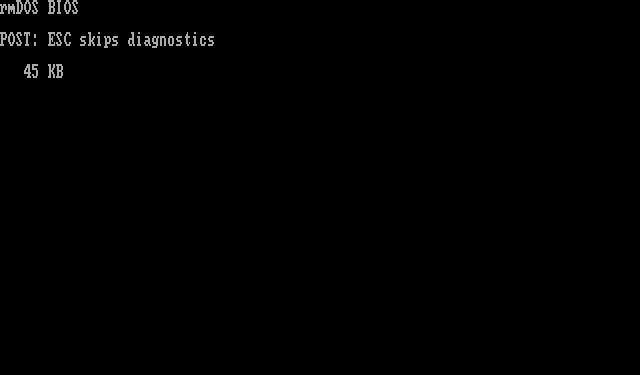

# rmDOS

[](https://github.com/Trugath/rmdos/actions/workflows/ci.yml)
[](LICENSE)
[](https://github.com/Trugath/rmdos/releases/tag/v0.8.0)

Clean-room **real-mode** stack for IBM PC/XT-class machines: motherboard system
ROMs (U18/U19) plus a DOS-compatible OS (8088/8086, ≤1 MiB conventional memory).

Developed and tested under [k8086](https://github.com/Trugath/k8086). Cassette
BASIC is intentionally omitted. A later DOS (protected mode / extender era) may
be derived from this project; **rmDOS itself stays real mode only**.



**License:** [MIT](LICENSE) — see [NOTICE](NOTICE) for submodule and reference notes.

## Layout

```
rmdos/
|-- emulator/k8086/     # Git submodule: IBM 5155/5160 Kotlin emulator
|-- firmware/
|   |-- bios/           # Clean-room XT system BIOS → u18.bin / u19.bin
|   |-- src/            # Boot sector + kernel + DOS tools (16-bit x86)
|   |-- linker/         # OS link scripts
|   |-- build/          # Generated ROMs, os.img, test.img, logs
|-- fixtures/          # boot/config/testdata/batch + elite drop-in
|-- scripts/            # Assembler wrapper, mkimg, run-k8086, wcc
|-- docs/               # Architecture + compatibility matrix
|-- tests/              # Host-side / E2E tests
|-- setup.sh            # Init submodule + build k8086 CLI
|-- Makefile
```

## Goals

- Clean-room **5155/5160-compatible** system BIOS (U18 32 KB + U19 8 KB), no ROM BASIC
- Real-mode 8088/8086 OS (`INT 21h`, `.COM` / `.EXE`, FAT12/FAT16 ≤128 MiB, `COMMAND.COM`)
- Develop and boot under [k8086](https://github.com/Trugath/k8086)

Architecture: [`docs/architecture.md`](docs/architecture.md).
Compatibility matrix: [`docs/compatibility.md`](docs/compatibility.md).

## Prerequisites

- Git (submodule for k8086)
- JDK **21+** (Gradle can download a toolchain; a host `java` is recommended)
- Assembler toolchain: GNU `as` / `ld` / `objcopy` targeting `elf_i386`
  (Linux/macOS packages, or the bundled MinGW tools under `tools/host/` on Windows)
- Python 3

### Windows host

Prefer **Git Bash** or **MSYS2** so `./setup.sh` and the Makefile recipes run as
written. From the repo root:

1. Install JDK 21+ and ensure `java -version` works in that shell.
2. Install Python 3 (`python3` or `py -3`; the Makefile uses `python3`).
3. Put the bundled assembler on `PATH` (or use an MSYS2 `mingw-w64` binutils that
   supports `elf_i386`):

   ```bash
   export PATH="$PWD/tools/host/bin:$PWD/tools/host/i686-elf/bin:$PATH"
   as --version    # GNU as
   ld -V           # must list elf_i386
   ```

4. `./setup.sh` then `make` / `make test`.

**WSL2** works the same as Linux once JDK 21+, Python 3, and `binutils` (`as`/`ld`
with `elf_i386`) are installed inside the distro; run `setup.sh` from the WSL
checkout (not a `/mnt/c/...` tree if Gradle/file watching misbehaves).

## Clone and build

```bash
git clone https://github.com/Trugath/rmdos.git
cd rmdos
./setup.sh          # submodule + k8086 installDist (not --recursive)
make                # firmware/build/{u18.bin,u19.bin,os.img}
make run            # boot OS on our chips (CGA window)
```

Headless (serial log):

```bash
./scripts/run-k8086.sh
```

## Tests

```bash
make test           # ROMs + BIOS service units + os.img/test.img e2e + ping gate
make test-bios      # BIOS ROM static checks + boot-sector service units
make test-dos-compat
make test-fd-img    # k8086 disks/fd.img → A:> on rmDOS U18/U19
make test-ping      # PING.COM → virtual gateway (DE-220 NIC)
make test-dhcp      # DHCP.COM → virtual DHCP lease (DE-220 NIC)
make test-bigexe    # ~75 KiB MZ streaming EXEC gate
make run-fd         # interactive disks/fd.img on our ROMs
```

### Elite (optional)

Drop 1987 CGA `ELITE.EXE` into [`fixtures/elite/`](fixtures/elite/)
(see that README; binaries are gitignored), then:

```bash
make run-elite      # lean floppy, CGA window, nonturbo realtime
make test-elite     # headless load smoke (skips if no binary)
```

Built `u18.bin` / `u19.bin` install into `emulator/k8086/roms/` as the emulator
defaults (`make bios` / `make install-roms`). Override at runtime with
`K8086_U18_ROM` / `K8086_U19_ROM`, `run-k8086.sh --u18/--u19`, or the workstation
**New…** / **Edit…** ROM dialogs (per-VM snapshots under `~/.k8086/vms/`).

## Releases

Push a version tag to publish the lean boot floppy and ROMs to
[GitHub Releases](https://github.com/Trugath/rmdos/releases) (changelog from
commits since the previous tag):

```bash
git tag v0.9.0
git push origin v0.9.0
```

Assets: `os.img`, `u18.bin`, `u19.bin`, `fdrom.bin`, and a `firmware.zip` bundle.
Rebuild an existing tag via Actions → **Release** → **Run workflow**.

## Boot flow

1. CPU reset at `0xFFFF0` far-jumps to `F000:E05B` (POST).
2. POST initializes chipset/BDA/IVT, scans option ROMs, then INT 19h.
3. INT 19h loads the floppy boot sector to `0000:7C00`.
4. Boot reads the FAT12/FAT16 `RFAT1` loader sector, loads `KERNEL.SYS` into `0070:0000`.
5. Kernel installs INT 20h/21h, runs a quiet FAT R/W self-check, then starts
   `COMMAND.COM` (empty `AUTOEXEC.BAT` → interactive `A:\>` prompt). The product
   image layout is `BIN\` (tools including FIND/CHOICE/MORE/FORMAT) and
   `DEMO\STAR`; `test.img` adds the DEMO/TEST harness. `PATH=A:\BIN`. Interactive
   `PING`/`DHCP` need the
   DE-220 card:
   `--card cards/de220/build/libs/de220-*.jar,base=0x300,irq=3,network=default`
   (e.g. `DHCP` then `PING 10.0.2.2`).

## Contributing

See [CONTRIBUTING.md](CONTRIBUTING.md).
