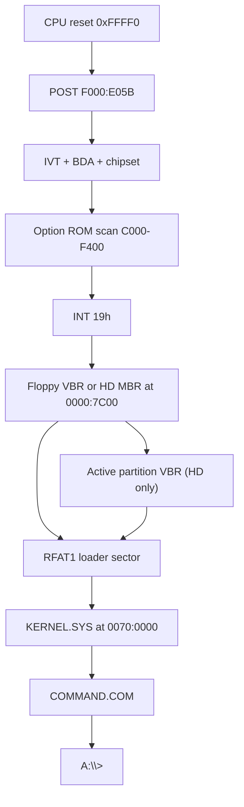

# rmDOS architecture

rmDOS is a clean-room **real-mode** stack for IBM PC/XT-class machines: system
BIOS chips (U18/U19) plus a DOS-compatible OS. Development and CI run on
[k8086](https://github.com/Trugath/k8086) (`emulator/k8086/`). The project is
MIT-licensed; see [LICENSE](../LICENSE) and [NOTICE](../NOTICE).

Cassette BASIC, protected mode, and DOS extenders are out of scope. A later
project may grow beyond real mode; **rmDOS itself stays real mode only**.

## Repository layout

```
rmdos/
|-- emulator/k8086/     # Git submodule: XT emulator + default ROMs/floppy
|-- firmware/
|   |-- bios/           # XT system BIOS → u18.bin / u19.bin
|   |-- src/boot/       # Floppy boot sector
|   |-- src/kernel/     # KERNEL.SYS (INT 20h/21h, FAT12/FAT16, loader)
|   |-- src/dos/        # COMMAND.COM and userland tools
|   |-- linker/         # OS link scripts
|   |-- build/          # Generated ROMs, images, logs
|-- fixtures/guest/     # AUTOEXEC variants + SAMPLE.TXT for image packing
|-- scripts/            # as8086, mkimg, pack_roms, run-k8086, wcc
|-- tests/              # Host-side / E2E gates
|-- Makefile
```

## Boot path



1. Reset vector in U18 far-jumps to `F000:E05B`.
2. POST initializes the chipset, BDA, and IVT; scans option ROMs; then INT 19h.
3. INT 19h tries the floppy boot sector at `0000:7C00`, then a hard-disk
   sector zero when floppy boot fails. A hard-disk MBR loads its active VBR.
4. The boot sector reads the RFAT1 loader sector and loads `KERNEL.SYS`
   (absolute LBA; independent of FAT12 vs FAT16).
5. The kernel installs INT 20h/21h, optionally runs a quiet FAT self-check, then
   starts `COMMAND.COM`. Empty `AUTOEXEC.BAT` drops to an interactive `A:\>` prompt.

## System BIOS (U18 / U19)

Clean-room XT motherboard ROMs for the 5155/5160 socket map used by k8086.
Built images are the emulator defaults under `emulator/k8086/roms/`.

| Image | Size | Linear map | Role |
|-------|------|------------|------|
| `u19.bin` | 8 KiB | `0xF6000–0xF7FFF` | Pad (`0xFF`). No Cassette BASIC. |
| `u18.bin` | 32 KiB | `0xF8000–0xFFFFF` | System BIOS |

Reset at `0xFFFF0`: `JMP FAR F000:E05B`.

Sources live under `firmware/bios/src/` (`post`, `init`, `video`, `keyboard`,
`timer`, `disk`, `misc`, entries, font).

### Compatibility surface

- IVT + BIOS Data Area (`0040:0000`)
- Equipment word (INT 11h) and conventional memory size (INT 12h)
- INT 10h (text + CGA modes 0–6): AH=00–03,05–0F including pixel read/write
  (`0Ch`/`0Dh`), CRTC cursor programming on set cursor/type, BEL beep, and
  graphics teletype scroll
- INT 13h floppy via onboard FDC (DMA ch2 / IRQ6): AH=00–05, 08, 15–16 with
  360K/720K/1.2M/1.44M media via BDA `40:8B` hint + INT 1Eh tables (FDC follows
  the live DPT). HD uses guest C800 Fixed Disk option ROM by default; host Fixed
  Disk BIOS is opt-in (`--hd-int13-bios` / `K8086_HD_INT13_BIOS=1`). Floppy host
  shim is opt-in (`--floppy-int13-shim` / `K8086_FLOPPY_INT13_SHIM=1`).
  INT 14h (COM1 8250 AH=00–03), 15h (AH=86h wait; AH=80h–82h succeed; else CF), 16h
  (AH=00–02,05 stuff,10–12→00–02; Caps/Num/Scroll/Insert flags), 17h
  (printer timeout stub), 18h, 19h, 1Ah
- INT 05h Print Screen (status at `0000:0500`; Shift+PrtSc from INT 09h)
- IRQ0 timer (INT 08h → INT 1Ch; floppy motor timeout) and IRQ1 keyboard (INT 09h);
  IRQ6 → INT 0Eh for FDC completion; IRQ5 → INT 0Dh for Fixed Disk (guest ROM)
- Option ROM scan `C000–F400` (`AA55`, checksum, far call +3); Fixed Disk ROM at `C800`
- INT 18h prints a short “no BASIC” message (U19 is not an interpreter)
- INT 1Eh diskette parameter table (720K default; 360K / 1.2M / 1.44M selectable)
- ROM identity: `F000:FFF5` release date, `FFFE=FEh` (XT), top-8K checksum 0

Pinned absolute entry points (k8086 and XT software expect these):

| Address | Purpose |
|---------|---------|
| `F000:E05B` | Cold/warm POST entry |
| `F000:E6F2` | INT 19h trampoline |
| `F000:E729` | Baud divisor table (INT 14h) |
| `F000:E739` | INT 14h trampoline |
| `F000:E82E` | INT 16h trampoline |
| `F000:E842` | F1 resume wait (headless auto-F1) |
| `F000:EA82` | Ctrl-Alt-Del warm-boot entry |
| `F000:EC59` | INT 13h trampoline |
| `F000:EFD2` | INT 17h trampoline |
| `F000:F065` | INT 10h entry trampoline |
| `F000:F841` | INT 12h trampoline |
| `F000:F84D` | INT 11h trampoline |
| `F000:F859` | INT 15h trampoline |
| `F000:FA6E` | 8×8 glyphs `0x00–0x7F` |
| `F000:FE6E` | INT 1Ah trampoline |
| `F000:FEA5` | IRQ0 / timer ISR trampoline |
| `F000:FF54` | INT 05h Print Screen trampoline |
| `F000:FFF0` | Reset vector |
| `F000:FFF5` | Release date / `FFFE` machine type |

BIOS service tests, boot E2E, and FORMAT floppy E2E use the guest FDC path
(default; `--floppy-int13-shim` re-enables the host shim for one smoke test).
Hard disk (`DL ≥ 0x80`) uses the guest C800 Fixed Disk option ROM by default;
`--hd-int13-bios` re-enables the host Fixed Disk BIOS. Override ROMs with
`K8086_U18_ROM` / `K8086_U19_ROM` / `K8086_FDROM`, `run-k8086.sh`, or the
workstation ROM picker.

## Operating system

DOS 3.3-ish real-mode kernel and shell, aimed at programs that run on an
8088/8086 with conventional memory only.

| Layer | Location | Role |
|-------|----------|------|
| Boot | `firmware/src/boot/` | Sector 0 + RFAT1 chain to `KERNEL.SYS` |
| Kernel | `firmware/src/kernel/` | INT 20h/21h, FAT12/FAT16 (≤40 MB), MCB memory, `.COM` / MZ `.EXE` loader |
| Shell / tools | `firmware/src/dos/` | `COMMAND.COM` and userland tools (see C vs asm below) |

### C vs assembly in userland

Most COM utilities are written in C and compiled with the in-tree **wcc**
Small-C compiler (`scripts/wcc.py` → GAS → `com.ld`). Shared INT 21h helpers
live in [`firmware/src/dos/inc/dos.h`](../firmware/src/dos/inc/dos.h).

| Built with wcc (C) | Left as assembly |
|--------------------|------------------|
| `COMMAND.COM`, DIR, TYPE, COPY, DEL, ATTRIB, LABEL, MOVE, XCOPY, CHKDSK, FIND, CHOICE, MORE, DEMO/STAR | Boot, kernel, BIOS; FORMAT, PARTEDIT, SYS; PING, DHCP, TELNET, NET; GZIP, GUNZIP; HELLO, COMPAT |

Keep assembly where fixed layout, interrupt ABI, or dense hardware I/O dominate
(boot sector, kernel IVT/`iret`/EXEC, NE2000, INT 13h format/partition tools).
Use C for DOS API + string/logic tools.


Notable INT 21h areas: console I/O (including AH=00 terminate and AH=0Ch
flush+dispatch), FCB open/close/create/delete/rename/seq+random I/O/find/parse
(AH=0Fh–17h/21h–22h/27h–29h), handle create/open/read/write/seek/delete,
temp create (AH=5Ah/5Bh), file lock stub (AH=5Ch), truename (AH=60h),
find-first/next, MCB alloc/free/resize (including grow), EXEC (AH=4Bh AL=0
load+run, AL=3 overlay), handle dup (AH=45h/46h), file datetime (AH=57h),
PSP get/set (AH=50h/51h/62h), SysVars (AH=52h), extended error (AH=59h),
IOCTL get/set info + input/output status (AH=44h AL=00/01/06/07/08/0Dh),
INT 25h/26h absolute disk, INT 2Fh install-check stubs (DOS AH=12, SHARE,
PRINT, APPEND, XMS; Windows AX=1600 absent), vectors (AH=25h/35h), Ctrl-C
(INT 23h abort) / critical error (INT 24h Abort/Retry/Ignore), date/time,
drive/cwd, mkdir/rmdir/chdir, attrs, rename, country get/set (AH=38h),
**AH=31h TSR**. AH=30h reports DOS 3.31. Gate: `DEMO\COMPAT.COM` +
`DEMO\INT21X.COM`.

**Out of scope for INT 21h/2Fh fidelity:** AH=53h BPB translate; real
SHARE/PRINT/APPEND/XMS TSR bodies; extended FCB; full SysVars/SFT/CDS graphs;
network redirector multiplex beyond “not installed.”

After the FAT self-test, the kernel opens **`CONFIG.SYS`** if present (missing file
is ignored). Supported lines: `INSTALL=` / `DEVICE=` (load+run a COM; failures
print and continue), `FILES=` / `BUFFERS=` (stored), `SHELL=` (overrides the
command processor path). Comments (`;`) and blank lines are skipped. Default
images ship **without** `CONFIG.SYS`.

`COMMAND.COM` supports internal CD/MD/RD/CLS/REN/VER/SET/PAUSE, external
program exec, `ECHO`, `IF ERRORLEVEL` / `IF EXIST`, `GOTO`/`CALL`, redirection
and pipes, and `AUTOEXEC.BAT`. `PATH=A:\BIN` is set in the kernel
environment. Internals present: `FOR`, `PROMPT`, `DATE`/`TIME`, `VOL`, `VERIFY`,
`BREAK`, `SHIFT`, `EXIT`, string `IF`, `CTTY` (CON/NUL). Wave-1 utilities present: `MEM`, `FC`, `TREE`, `SORT`. Wave-2:
`EDIT` (16 KiB heap buffer, find, `/Q` smoke), `DEBUG` (debuggee arena, R/G/T/P),
`DISKCOPY` / `DISKCOMP`, `MODE` (COM1).

`CHKDSK [d:] [/F]` audits the volume via INT 25h: BPB sanity, FAT1↔FAT2 compare,
directory chain walk (cross-links / orphans / bad chains), and a classic-style
space report. `/F` repairs FAT copies and lost chains when possible. Prints
`CHKDSK OK` when the scan completes without I/O failure.

`GZIP [src [dst]]` / `GUNZIP [src [dst]]` compress and decompress a single gzip
member (RFC 1952, DEFLATE method 8). Zero args use stdin→stdout; one arg reads a
file to stdout. Status lines are omitted when writing to stdout so pipes and
redirects stay binary-clean. Compression emits stored DEFLATE blocks;
decompression accepts stored, fixed, and dynamic Huffman blocks. Source files are
kept. Shared codec includes live under [`firmware/src/dos/inc/`](../firmware/src/dos/inc/)
(`crc32.inc`, `deflate.inc`, `inflate.inc`).

Network tools (`PING`, `DHCP`, `TELNET`) talk to the k8086 DE-220 NE2000-class
card on the virtual NAT network (typical gateway `10.0.2.2`). Shared assembly
lives under [`firmware/src/dos/inc/`](../firmware/src/dos/inc/) (`ne2000.inc`,
`netlease*.inc`, `nettsr.inc`, `netutil.inc`, `dns.inc`).

**Standalone (default):** each COM owns the card while it runs. Lease is
cwd-relative **`LEASE.DAT`** (24 bytes): magic `"DHCP"`, version `1`, then
yiaddr / gateway / mask / DNS. `DHCP.COM` writes the file; `PING`/`TELNET`
require it.

**Resident (optional):** `INSTALL=A:\BIN\NET.COM` in `CONFIG.SYS` loads
`NET.COM`, which hooks **INT 60h** `AH=B8h` (multiplex version in `BX`,
currently **2**) and stays resident (AH=31; frees its env, shrinks the PSP).
The NIC is initialized lazily on the first MAC/TX/RX multiplex call (with
`ES=DS=CS` inside the TSR). When present, DHCP/PING/TELNET use the multiplex
for MAC/TX/RX and lease (`AL=1`–`5`; no `LEASE.DAT`) so the TSR owns the NIC
exclusively. `AL=0` install check, `AL=6` NIC-ready, `AL=7` prepare-unload
(restore INT 60; caller frees the PSP). `NET /U` unloads when the version
matches. CF for TX/RX/lease is returned via the IRET flags frame.
`BIN\NETTEST.COM` on `os-net.img` smoke-tests the mux. Default images leave
INSTALL **off**. (INT 60h avoids colliding with DOS INT 2Fh probes.)

`PING`/`TELNET` accept an IPv4 address or DNS hostname and resolve A records via
the lease DNS server (typically the NAT gateway `10.0.2.2`). `TELNET host [port]`
is an outbound TCP client (default port 23) with minimal NVT (skips IAC option
negotiation) and a small ANSI CSI interpreter (`ESC[H`/`J`/`K`/cursor moves;
SGR ignored) so full-screen animations work on the CGA console. The emulator
NAT is outbound-only, so connect to a reachable non-gateway address such as
`localhost` / `127.0.0.1` (not `10.0.2.2`). Emulator card wiring:
`base=0x300,irq=3,network=default`.

The kernel reads the boot-sector BPB at init (geometry, FAT/root placement,
sectors per cluster) so volumes are not limited to a hardcoded 720 KB map.
`FORMAT [d:] [/S] [/Y]` builds FAT12 or FAT16 from INT 13h AH=08 geometry
(auto-selected by cluster count; `CountOfClusters < 4085` → FAT12) and can
install `KERNEL.SYS` + `COMMAND.COM` (`/S`). Drive letters: `A:`/`B:` are
floppies; hard-disk DOS primaries (`01h`/`04h`/`06h`) are assigned `C:` onward in
slot order per BIOS unit (`80h`, `81h`, …). A whole-disk FAT VBR (no DOS
partition) still gets one letter at LBA 0. `PARTEDIT` lists HD addresses and
primaries (with letters), edits via an interactive menu or scriptable
`/CREATE` `/DELETE` `/ACTIVE` `/TYPE` `/LIST` (primaries only; optional
`/SIZE`). `PARTEDIT /CREATE` creates an active primary (leaving track zero for
an MBR) and picks type by size (`01`/`04`/`06`); `FORMAT` rewrites that type to
match the filesystem it built. Hard disks are limited to **40 MB**; larger
geometries are rejected. The kernel uses a windowed FAT cache and remounts when
the current drive changes.

### Floppy image layout

Default `os.img` / k8086 `disks/fd.img` (720 KB FAT12):

```
A:\
  KERNEL.SYS
  COMMAND.COM
  INSTALL.BAT
  AUTOEXEC.BAT
  BIN\     DIR TYPE COPY DEL ATTRIB LABEL MOVE XCOPY CHKDSK SYS PARTEDIT
           FORMAT FIND CHOICE MORE MEM FC TREE SORT EDIT DEBUG DISKCOPY
           DISKCOMP MODE PING DHCP TELNET NET GZIP GUNZIP
            (os-net.img also: NETTEST)
  DEMO\    HELLO.COM HELLO.EXE COMPAT.COM INT21X.COM STAR.COM
  TEST\    SAMPLE.TXT DBG.SCR BIG.TXT
```

Packing fixtures live in [`fixtures/guest/`](../fixtures/guest/README.md)
(AUTOEXEC variants for compat / ping / dhcp / telnet / net / star / batch / disk / format /
partedit / multilet / install / fat16 gates). `INSTALL.BAT` on the floppy walks PARTEDIT → FORMAT C: /S
→ DIR C: for hard-disk installs. `os-net.img` also packs `CONFIG.SYS` with
`INSTALL=A:\BIN\NET.COM`.

## Build and test

```text
./setup.sh                 # submodule + k8086 installDist
make                       # u18.bin, u19.bin, os.img
make bios / make os
make install-roms          # → emulator/k8086/roms/
make install-floppy        # → emulator/k8086/disks/fd.img
make test                  # ROMs + BIOS units + OS e2e + ping
make test-dos-compat
make test-fd-img           # shipped fd.img on rmDOS ROMs
make run / make run-fd
```

BIOS service units are boot-sector images under `firmware/bios/tests/boot/`; they
print `PASS`/`FAIL` on COM1 and shut down via port `0x8900`. Coverage includes
equipment/BDA, INT 10h text/graphics (modes, scroll, pixels, CRTC cursor/type,
graphics teletype scroll, active page, palette, BEL), INT 13h floppy via FDC with
shim off (reset/read/write/format/DASD/status, 360K/720K/1.2M/1.44M AH=08, 360→720
upgrade, change-line), C800 Fixed Disk AH=08/R/W (with blank HD attached),
timer/INT 1Ch/INT 1Ah set, INT 14h COM1 loopback, INT 15h wait/no-ops, INT 16h
flags/extended APIs plus IRQ1 Caps and Shift+PrtSc via scancode inject port
`0x8901`, INT 17h stub edges, INT 05h/INT 18h no-BASIC, ROM identity/checksum,
and IBM entry trampolines. Host-only inject assists: `0x8901` scancode,
`0x8902` FDC disk-change. Not covered: real printer success, COM2–4, CAD warm-boot
unit (e2e elsewhere).

## References

- IBM 5160 Technical Reference (behavioral contract for BIOS)
- [pcxtbios](https://github.com/virtualxt/pcxtbios/) — service-table reference only; source is not copied
- k8086 [`docs/architecture.md`](../emulator/k8086/docs/architecture.md) — emulator module map and boot wiring
- k8086 [`roms/README.md`](../emulator/k8086/roms/README.md) — socket layout and ROM overrides
