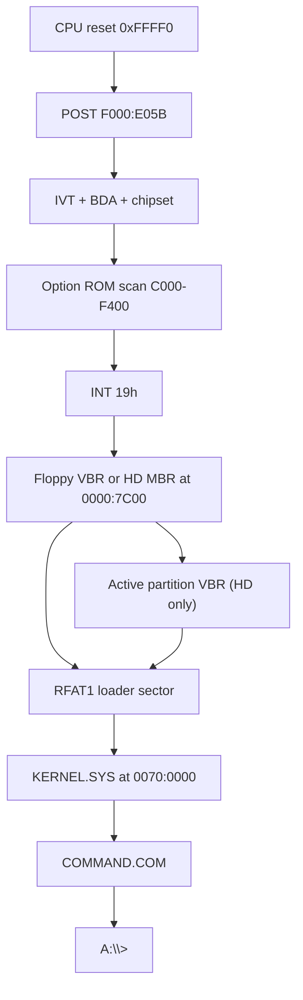

# rmDOS architecture

rmDOS is a clean-room **real-mode** stack for IBM PC/XT-class machines: system
BIOS chips (U18/U19) plus a DOS-compatible OS. Development and CI run on
[k8086](https://github.com/Trugath/k8086) (`emulator/k8086/`). The project is
MIT-licensed; see [LICENSE](../LICENSE) and [NOTICE](../NOTICE). For a one-page
in-scope / stub / OOS matrix, see [compatibility.md](compatibility.md).

Cassette BASIC, protected mode, DOS extenders, and XMS/HIMEM (AT extended
memory / A20) are out of scope. 5155/5160-class machines use conventional RAM,
optional UMB, and **LIM EMS** for extra memory. A later project may grow beyond
real mode; **rmDOS itself stays real mode only**.

## Repository layout

```
rmdos/
|-- emulator/k8086/     # Git submodule: XT emulator + default ROMs/floppy
|-- firmware/
|   |-- bios/           # XT system BIOS → u18.bin / u19.bin
|   |-- src/boot/       # Floppy boot sector
|   |-- src/kernel/     # KERNEL.SYS (INT 20h/21h, FAT12/FAT16, loader)
|   |-- src/dos/        # COMMAND.COM and userland tools
|   |-- linker/         # OS link scripts
|   |-- build/          # Generated ROMs, images, logs
|-- fixtures/guest/     # AUTOEXEC variants + SAMPLE.TXT for image packing
|-- scripts/            # as8086, mkimg, pack_roms, run-k8086, wcc
|-- tests/              # Host-side / E2E gates
|-- Makefile
```

## Boot path



1. Reset vector in U18 far-jumps to `F000:E05B`.
2. POST initializes the chipset, BDA, and IVT; scans option ROMs; then INT 19h.
3. INT 19h tries the floppy boot sector at `0000:7C00`, then a hard-disk
   sector zero when floppy boot fails. A hard-disk MBR loads its active VBR.
4. The boot sector reads the RFAT1 loader sector and loads `KERNEL.SYS`
   (absolute LBA; independent of FAT12 vs FAT16).
5. The kernel installs INT 20h/21h, optionally runs a quiet FAT self-check, then
   starts `COMMAND.COM`. Empty `AUTOEXEC.BAT` drops to an interactive `A:\>` prompt.
   Mount rejects malformed BPBs (bad SPC/geometry/layout, missing `AA55`, no data
   region) with a serial `fat fail` instead of dividing by zero.

## System BIOS (U18 / U19)

Clean-room XT motherboard ROMs for the 5155/5160 socket map used by k8086.
Built images are the emulator defaults under `emulator/k8086/roms/`.

| Image | Size | Linear map | Role |
|-------|------|------------|------|
| `u19.bin` | 8 KiB | `0xF6000–0xF7FFF` | Pad (`0xFF`). No Cassette BASIC. |
| `u18.bin` | 32 KiB | `0xF8000–0xFFFFF` | System BIOS |

Reset at `0xFFFF0`: `JMP FAR F000:E05B`.

Sources live under `firmware/bios/src/` (`post`, `init`, `video`, `keyboard`,
`timer`, `disk`, `misc`, entries, font).

### Compatibility surface

- IVT + BIOS Data Area (`0040:0000`)
- Equipment word (INT 11h) and conventional memory size (INT 12h)
- INT 10h (text + CGA modes 0–6): AH=00–0F including light-pen stub (`04h` →
  AH=0), pixel read/write (`0Ch`/`0Dh`), write string (`13h` AL=0/1 chars+BL
  attr; AL=2/3 char+attr pairs), text and CGA-plane window scrolling
  (`06h`/`07h`), CRTC cursor programming on set cursor/type, BEL beep, graphics
  teletype scroll, AH=05 active-page select clamped to CGA regen (unit
  `bt_page`), and AH=08/09/0A/13 graphics-plane glyph I/O (write via font plot;
  read via pixel→font match; high ASCII via INT 1Fh).
- INT 13h floppy via onboard FDC (DMA ch2 / IRQ6): AH=00–05, 08, 15–18 with
  360K/720K/1.2M/1.44M media via BDA `40:8B` hint + INT 1Eh tables (FDC follows
  the live DPT; AH=08 returns the equipment-word floppy count in DL; AH=17
  stores DASD type at `40:8C`+DL, AH=18 selects media table).
  HD uses guest C800 Fixed Disk option ROM by default; host Fixed
  Disk BIOS is opt-in (`--hd-int13-bios` / `K8086_HD_INT13_BIOS=1`). Floppy host
  shim is opt-in (`--floppy-int13-shim` / `K8086_FLOPPY_INT13_SHIM=1`).
  INT 14h (COM1/COM2 via BDA `40:00`/`40:02`, AH=00–03; missing base → timeout;
  POST probes `3F8`/`2F8`; unit `bt_misc`), 15h
  (AH=86h wait via IRQ0 ticks + PIT ch0 residual; AH=80h–82h succeed; AH=C0h XT
  config table; else CF), 16h
  (AH=00–02,05 stuff,10–12; Caps/Num/Scroll/Insert flags and Alt-keypad
  decimal ASCII entry; Alt+non-keypad returns AL=0; Ctrl+NumLock pause/hold;
  AH=12 returns FLAG0+FLAG1 held bits), 17h
  (LPT1/LPT2 at BDA `40:08`/`40:0A`; AH=00–02; status forced ready/selected;
  POST probes `378`/`278`; unit `bt_misc`),
  18h, 19h, 1Ah
- INT 05h Print Screen (status at `0000:0500`; Shift+PrtSc from INT 09h)
- IRQ0 timer (INT 08h → INT 1Ch; floppy motor timeout) and IRQ1 keyboard (INT 09h);
  Ctrl-Break (Ctrl+scancode 46h) latches BDA `40:18` bit7 and invokes INT 1Bh
  (DOS hooks INT 1Bh to raise INT 23h when BREAK ON);
  IRQ6 → INT 0Eh for FDC completion (POST PIC test restores IMR `0xBC` so IRQ6
  stays unmasked with IRQ0+1); IRQ5 → INT 0Dh for Fixed Disk (guest ROM)
- INT 1Fh → high-ASCII 8×8 font (`bios_font_hi`); glyphs `00–7F` at `F000:FA6E`
  include control shapes and distinct lowercase
- Option ROM scan `C000–F400` (`AA55`, checksum, far call +3); Fixed Disk ROM at `C800`
- INT 18h prints a short “no BASIC” message (U19 is not an interpreter)
- INT 1Eh diskette parameter table (720K default; 360K / 1.2M / 1.44M selectable)
- ROM identity: `F000:FFF5` release date, `FFFE=FEh` (XT), top-8K checksum 0

Pinned absolute entry points (k8086 and XT software expect these):

| Address | Purpose |
|---------|---------|
| `F000:E05B` | Cold/warm POST entry |
| `F000:E6F2` | INT 19h trampoline |
| `F000:E729` | Baud divisor table (INT 14h) |
| `F000:E739` | INT 14h trampoline |
| `F000:E82E` | INT 16h trampoline |
| `F000:E842` | F1 resume wait (headless auto-F1) |
| `F000:EA82` | Ctrl-Alt-Del warm-boot entry |
| `F000:EC59` | INT 13h trampoline |
| `F000:EFD2` | INT 17h trampoline |
| `F000:F065` | INT 10h entry trampoline |
| `F000:F841` | INT 12h trampoline |
| `F000:F84D` | INT 11h trampoline |
| `F000:F859` | INT 15h trampoline |
| `F000:FA6E` | 8×8 glyphs `0x00–0x7F` (control shapes + distinct lowercase) |
| INT 1Fh | High-ASCII glyphs `0x80–0xFF` (`bios_font_hi`) |
| `F000:FE6E` | INT 1Ah trampoline |
| `F000:FEA5` | IRQ0 / timer ISR trampoline |
| `F000:FF54` | INT 05h Print Screen trampoline |
| `F000:FFF0` | Reset vector |
| `F000:FFF5` | Release date / `FFFE` machine type |

BIOS service tests, boot E2E, and FORMAT floppy E2E use the guest FDC path
(default; `--floppy-int13-shim` re-enables the host shim for one smoke test).
Hard disk (`DL ≥ 0x80`) uses the guest C800 Fixed Disk option ROM by default;
`--hd-int13-bios` re-enables the host Fixed Disk BIOS. Override ROMs with
`K8086_U18_ROM` / `K8086_U19_ROM` / `K8086_FDROM`, `run-k8086.sh`, or the
workstation ROM picker.

## Operating system

DOS 3.3-ish real-mode kernel and shell, aimed at programs that run on an
8088/8086 with conventional memory only.

| Layer | Location | Role |
|-------|----------|------|
| Boot | `firmware/src/boot/` | Sector 0 + RFAT1 chain to `KERNEL.SYS` |
| Kernel | `firmware/src/kernel/` | INT 20h/21h, FAT12/FAT16 (≤128 MB), MCB memory, streaming `.COM` / MZ `.EXE` loader |
| Shell / tools | `firmware/src/dos/` | `COMMAND.COM` and userland tools (see C vs asm below) |

### C vs assembly in userland

Most COM utilities are written in C and compiled with the in-tree **wcc**
Small-C compiler (`scripts/wcc.py` → GAS → `com.ld`). Shared INT 21h helpers
live in [`firmware/src/dos/inc/dos.h`](../firmware/src/dos/inc/dos.h).

| Built with wcc (C) | Left as assembly |
|--------------------|------------------|
| `COMMAND.COM`, DIR, TYPE, COPY, DEL, ATTRIB, LABEL, MOVE, XCOPY, CHKDSK, FIND, CHOICE, MORE, MEM, FC, TREE, SORT, EDIT, DEBUG, MODE, SUBST, COMP, ASSIGN, DEMO/STAR | Boot, kernel, BIOS; FORMAT, PARTEDIT, SYS; PING, DHCP, TELNET, NET; GZIP, GUNZIP; HELLO, COMPAT; MOUSE, MOUSETST; CLOCK |

Keep assembly where fixed layout, interrupt ABI, or dense hardware I/O dominate
(boot sector, kernel IVT/`iret`/EXEC, NE2000, INT 13h format/partition tools).
Use C for DOS API + string/logic tools.


Notable INT 21h areas: console I/O (including AH=00 terminate and AH=0Ch
flush+dispatch), InDOS nest flag (AH=34h), FCB open/close/create/delete/rename/
seq+random I/O/find/parse (AH=0Fh–17h/21h–22h/27h–29h; extended FCB `FFh` prefix
honors find attribute on AH=11h/12h), handle create/open/read/write/seek/delete,
temp create (AH=5Ah/5Bh), file lock stub (AH=5Ch), truename (AH=60h),
find-first/next (AH=4Eh/4Fh: classic H|S|D subset of search attr; volume-only
path unchanged), MCB alloc/free/resize (including grow; AH=48h honors AH=58h
first/best/last-fit strategy), EXEC (AH=4Bh AL=0
load+run, AL=1 load-only, AL=3 overlay — streams from disk into the AH=48
block with a small MZ header scratch, so EXEs larger than the old ~28 KiB
`com_buf` work), handle dup (AH=45h/46h), file datetime
(AH=57h), PSP create/get/set (AH=26h/50h/51h/55h/62h), get DTA (AH=2Fh),
allocation info (AH=1Bh/1Ch; AH=1Ch honors DL), DPB get (AH=1Fh/32h from live
BPB for any mapped drive; device-header pointer at DPB +13/+15 → NUL),
SysVars (AH=52h LoL slice: first MCB, SFT header + classic SFTE table built from
private handles, CON, CDS, boot drive, BUFFERS= header chain),
extended error (AH=59h), AUX/PRN (handles 3/4; AH=03/04/05 via INT 14h/17h),
IOCTL get/set info + char R/W + status (AH=44h AL=00–03/06–08; AL=02/03 CON/AUX/
PRN/NUL byte I/O; AL=06/07 honest CON kbd / AUX line / PRN busy; AL=04/05/0Dh fail
honestly), handle count get/set (AH=67h),
INT 25h/26h absolute disk, INT 2Fh install-check stubs (DOS AH=12, SHARE, PRINT,
APPEND, XMS; Windows AX=1600 absent), vectors (AH=25h/35h), Ctrl-C / Ctrl-Break
(BIOS INT 1Bh → INT 23h when BREAK ON; abort) / critical error (INT 24h
Abort/Retry/Ignore), VERIFY flag get/set (AH=2Eh/54h; ON → INT 13h AH=04 after
sector writes) and commit (AH=68h → `handle_flush_file`), date/time, drive/cwd,
mkdir/rmdir/chdir, attrs, rename, country get/set (AH=38h; identity case-map
words), extended country (AH=65h AL=01 header+info / AL=02 case-map ptr), and
global code page get/set (AH=66h), **AH=31h TSR**.
AH=30h reports DOS 3.31. Gate:
`DEMO\COMPAT.COM` + `DEMO\INT21X.COM` (markers include `FILES OK`, `EXEC1 OK`,
`AUXPRN OK`, `BREAK23 OK`, `STUB OK`; INT21X also probes IOCTL AL=02–05/0Dh/06,
DPB device ptr, last-fit AH=58, AH=46/57, INT 25h boot signature, honest AH=5Ch,
unsupported AH=5Dh/5Eh/5Fh/65h AL=03, AH=66 get/set CP 437, VERIFY flag get/set,
non-null BUFFERS + SFTE LoL walk, and LoL LASTDRIVE).

### Stub vs real (INT 21h / CONFIG)

| Surface | Behavior |
|---------|----------|
| VERIFY (`AH=2Eh`/`54h`) | Flag + INT 13h AH=04 re-verify after successful sector writes |
| File lock (`AH=5Ch`) | CF + AX=1 (SHARE not installed) |
| IOCTL AL=04/05/0Dh | CF + AX=1 (control channels unsupported) |
| IOCTL AL=09/0Ah | Success AX=0 (treat as local); AL=06/07 CON/AUX/PRN/file status |
| SysVars SFT chain (`AH=52h`) | Header + SFTE table (0x35) mirrored from private `handles[]` |
| PSP JFT (`18h`/`32h`/`34h`) | Sized to `FILES=` / AH=67 (`max_handles`, 5..64); ≤20 entries inline at PSP:18h, larger tables in an AH=48 block; resized on handle growth; inherited from parent when present |
| INT 25h/26h `CX=FFFFh` | DOS 3.31 packet (`DWORD` sector, `WORD` count, far buffer); classic register form remains supported |
| Network/server `AH=5Dh`/`5Eh`/`5Fh` | CF + AX=1 (redirector not installed) |
| `BUFFERS=` | Parsed; LoL +12/+14 points at free buffer-header chain (FAT I/O still windowed) |
| `STACKS=` / `FCBS=` / `DRIVPARM=` | Accepted as advisory no-ops (not printed as ignored) |
| `COUNTRY=` | `COUNTRY=nnn[,codepage]` updates country id + AH=66 code pages |
| `SHELL=` | Path only — CONFIG discards `/P` `/E:`; COMMAND itself honors `/E:n` on its argv |
| `DEVICE=` | Character `.SYS` only (≤8 KiB); **block drivers intentional OOS** (reject + clear CONFIG text; follow-on) |
| `LASTDRIVE=` | Raises CDS count (compile max 16; default 8) |
| Unknown `CONFIG.SYS` lines | Printed as `CONFIG: ignored …` |
| FAT16 volume size | Hard ceiling **128 MiB**; partition bases and HiddenSectors are 32-bit |
| `MODE LPT1:=COM1` | Honest fail (`Redirect not supported`, ERRORLEVEL 1) |
| INT 60h `AH=B8h` | rmDOS-only net mux (not packet-driver / redirector) |
| INT 10h gfx AH=08/09/0A/13 | Plane glyph plot/match (units `bt_gfx_char`); high ASCII via INT 1Fh |
| INT 17h LPT1 status | Floating port forced ready/selected (documented) |

**Out of scope for INT 21h/2Fh fidelity:** AH=53h BPB translate; real
SHARE/PRINT/APPEND/XMS TSR bodies; JOIN and full SHARE/network SFT graphs;
network redirector multiplex beyond “not installed”; block `DEVICE=` drivers;
COM3–4 / LPT3; MDA/EGA; FAT16 above 128 MiB. Live CDS paths and
`SUBST.COM` (via INT 2Fh `AX=12E0h`/`12E1h`) are in scope. COM2/LPT2 are
supported via ISA cards + BIOS BDA probe / INT 14h/17h. LIM EMS is in scope via
`DEVICE=A:\BIN\EMM.SYS` + the k8086 `ems-window` card (not XMS).

After the FAT self-test, the kernel opens **`CONFIG.SYS`** if present (missing file
is ignored). Supported lines: `INSTALL=` (load+run a COM with its trailing
arguments in the child PSP command tail), `DEVICE=` (character `.SYS` only via
the SYS ABI — INIT + INPUT + OUTPUT; block drivers print
`CONFIG: DEVICE is not a character driver` and continue — intentional OOS),
`FILES=` / `BUFFERS=` (`FILES=` clamps 5..64 into the handle table and current
PSP JFT after CONFIG; default 20; AH=67 grows both), `LASTDRIVE=` (letter or
count, max 16), `BREAK=`,
`SHELL=` (path only in CONFIG — `/P`/`/E:` discarded there; `COMMAND` honors
`/E:n` on its own argv), `COUNTRY=nnn[,codepage]` (updates
country id + active/system code page), and advisory no-ops `STACKS=` /
`FCBS=` / `DRIVPARM=`. Unknown directives print
`CONFIG: ignored …`. Comments (`;`) and blank lines are skipped. Builtin
**CON** / **NUL** device headers form the driver chain; `putch`, AH=40 CON writes,
and AH=01/08/3F CON reads call the current CON driver’s OUTPUT/INPUT. Default
images ship **without** `CONFIG.SYS`.

Optional **`DEVICE=A:\BIN\ANSI.SYS`** loads a CON-named character driver that
interprets ESC/CSI (cursor, erase, SGR colors) before teletype; ESC/CSI bytes are
not mirrored to COM1. INPUT forwards to the next CON driver unless a tiny CSI `p`
key-remap entry is active (F1 → `!`). `PROMPT $e` emits ESC so ANSI prompts work
when the driver is loaded.

Optional **`DEVICE=A:\BIN\EMM.SYS`** loads a LIM EMS 3.2 character driver
(`EMMXXXX0`, INT 67h) for the k8086 `ems-window` card (I/O `260h`–`263h`, frame
`D000h`). Default `mem-expansion` UMB also claims `D0000`; use `umbBase=0` when
combining both. Gate: `DEMO\EMSTST.COM` (`EMS OK`). `MEM.COM` prints an Expanded
Memory section when EMM is present.

`COMMAND.COM` supports internal CD/MD/RD/CLS/REN/VER/SET/PAUSE/REM/`PATH`/`ERASE`,
external program exec with `PATH` walk and `%var%` from the PSP environment (env
expansion on the full command line), bare `COPY` via `BIN\COPY.COM` (`/V`/`/A`/`/B`,
wildcards, `+` concat, directory dest), `ECHO` / `ECHO ON`/`OFF`, `IF` / `IF … ELSE`
(same line), `GOTO`/`CALL` (GOTO seeks so labels work backward; CALL arg frames
stack to batch depth), dual `<`/`>` redirection and pipes, `/C` (run one command
then exit; no AUTOEXEC) and `/P` (permanent shell), and `AUTOEXEC.BAT`. `/E:n`
sets the environment block size (clamped ~160–32768 bytes). Batch/`FOR`/`CALL`
nest to depth 8. Pipes use sequential unique temps on the current drive
(`X:\PIPEn.$$`) and support chained `|` (still not concurrent DOS pipe
semantics). `ERRORLEVEL` is updated for external EXEC and for CD/MD/RD/DEL/REN/
TYPE/DIR/CTTY failures and Bad command. `DIR` supports classic `/W` and `/P` plus
date/time columns; optional `/O` (`N`/`E`/`D`/`S`/`G`, optional `-` reverse) sorts
a buffered listing (default remains on-disk FindFirst order; cap 80 entries). `DEL`/`ERASE` accept wildcards. `FOR` nests to batch
depth. `CTTY CON`/`NUL` with one-level restore of handles 0/1/2.
`PATH=A:\BIN` is set in the kernel environment. Internals present:
`FOR`, `PROMPT` (`$e` ESC, `$h` backspace, `$v` version), `DATE`/`TIME`
(interactive prompt outside batch), `VOL [d:]`, `VERIFY`,
`BREAK`, `SHIFT`, `EXIT`, string `IF`, `CTTY` (CON/NUL). DIR headers use the current
drive/cwd. Wave-1 utilities present:
`MEM`, `FC` (streamed binary compare), `TREE` (recursive; `/F` lists files), `SORT`.
Wave-2: `EDIT` (16 KiB heap buffer, find, `/Q` smoke),
`DEBUG` (debuggee arena, R/G/T/P), `DISKCOPY` / `DISKCOMP`, `MODE` (COM1 baud;
`40`/`80`/`BW80`/`CO80`; CON columns; `LPT1:=COM1` reports unsupported; LPT retry/`,,P`
soft-acked), `COPY`
(`/V` VERIFY; `/A`/`/B`; wildcards/concat), `XCOPY` (`/S`/`/E`/`/P`/`/V`/`/A`/`/D`),
`ATTRIB` with `/S`, `FIND` with
`/V`/`/C`/`/N` (file or stdin), `SUBST` / `ASSIGN` (drive remap via INT 2Fh
`12E0h`/`12E1h`), `COMP` (binary file compare).
`BIN\ANSI.SYS` is packed
for optional `DEVICE=` load (off by default).

`CHKDSK [d:] [/F]` audits the volume via INT 25h: BPB sanity, FAT1↔FAT2 compare,
directory chain walk (cross-links / orphans / bad chains), and a classic-style
space report. `/F` repairs FAT copies and lost chains when possible. Prints
`CHKDSK OK` when the scan completes without I/O failure.

`GZIP [src [dst]]` / `GUNZIP [src [dst]]` compress and decompress a single gzip
member (RFC 1952, DEFLATE method 8). Zero args use stdin→stdout; one arg reads a
file to stdout. Status lines are omitted when writing to stdout so pipes and
redirects stay binary-clean. Compression emits stored DEFLATE blocks;
decompression accepts stored, fixed, and dynamic Huffman blocks. Source files are
kept. Shared codec includes live under [`firmware/src/dos/inc/`](../firmware/src/dos/inc/)
(`crc32.inc`, `deflate.inc`, `inflate.inc`).

Network tools (`PING`, `DHCP`, `TELNET`) talk to the k8086 DE-220 NE2000-class
card on the virtual NAT network (typical gateway `10.0.2.2`). Shared assembly
lives under [`firmware/src/dos/inc/`](../firmware/src/dos/inc/) (`ne2000.inc`,
`netlease*.inc`, `nettsr.inc`, `netutil.inc`, `dns.inc`).

**Standalone (default):** each COM owns the card while it runs. Lease is
cwd-relative **`LEASE.DAT`** (24 bytes): magic `"DHCP"`, version `1`, then
yiaddr / gateway / mask / DNS. `DHCP.COM` writes the file; `PING`/`TELNET`
require it.

**Resident (optional):** `INSTALL=A:\BIN\NET.COM` in `CONFIG.SYS` loads
`NET.COM`, which hooks **INT 60h** `AH=B8h` and stays resident (AH=31; frees
its env, shrinks the PSP). This multiplex is an **rmDOS-only ABI** — not a
Crynwr/FTP packet-driver interface and not an INT 2Fh network redirector.

| AL | Function | Notes |
|----|----------|-------|
| 0 | Install check | `AL=FFh`, `BX`=version (currently **2**) |
| 1 | Get MAC | `ES:DI` ← 6 bytes |
| 2 | Transmit | `DS:SI` frame, `CX`=len; CF=error via IRET flags |
| 3 | Receive | `ES:DI` buf, `BX`=max; CF=none else `CX`=len |
| 4 | Get lease | `ES:DI` ← 24-byte lease; CF=invalid |
| 5 | Set lease | `DS:SI` → 24-byte lease |
| 6 | NIC ready | `AL=1` if NIC initialized |
| 7 | Prepare unload | restore INT 60; `BX`=TSR PSP |

The NIC is initialized lazily on the first MAC/TX/RX multiplex call (with
`ES=DS=CS` inside the TSR). When present, DHCP/PING/TELNET use the multiplex
for MAC/TX/RX and lease (`AL=1`–`5`; no `LEASE.DAT`) so the TSR owns the NIC
exclusively. `NET /U` unloads when the version matches. `BIN\NETTEST.COM` on
`os-net.img` smoke-tests install-check, MAC, TX, and NIC-ready. Default images
leave INSTALL **off**. (INT 60h avoids colliding with DOS INT 2Fh probes.)

`PING`/`TELNET` accept an IPv4 address or DNS hostname and resolve A records via
the lease DNS server (typically the NAT gateway `10.0.2.2`). `TELNET host [port]`
is an outbound TCP client (default port 23) with minimal NVT (skips IAC option
negotiation) and a small ANSI CSI interpreter (`ESC[H`/`J`/`K`/cursor moves;
SGR ignored) so full-screen animations work on the CGA console. The emulator
NAT is outbound-only, so connect to a reachable non-gateway address such as
`localhost` / `127.0.0.1` (not `10.0.2.2`). Emulator card wiring:
`base=0x300,irq=3,network=default`.

The kernel reads the boot-sector BPB at init (geometry, FAT/root placement,
sectors per cluster) so volumes are not limited to a hardcoded 720 KB map.
`FORMAT [d:] [/S] [/Y] [/V[:label]] [/F:360|720|1200|1.2|1440] [/1] [/4] [/8]`
builds FAT12 or FAT16
from INT 13h AH=08 geometry (auto-selected by cluster count;
`CountOfClusters < 4085` → FAT12), supports classic floppy presets and volume
labels, and can install `KERNEL.SYS` + `COMMAND.COM` (`/S`).
`SYS [src:] dest:` copies those two files from the optional source drive
(the current drive by default), preserves the target FAT/BPB and unrelated root
entries, then installs boot code plus regenerated RFAT1 metadata. The target must have rmDOS'
second reserved sector (FORMAT now reserves it even without `/S`). Drive
letters: `A:`/`B:` are
floppies; hard-disk DOS primaries (`01h`/`04h`/`06h`) and logicals inside
extended containers (`05h`/`0Fh`) are assigned `C:` onward in slot order per
BIOS unit (`80h`, `81h`, …). A whole-disk FAT VBR (no DOS partition) still gets
one letter at LBA 0. `PARTEDIT` lists HD addresses and volumes (with letters),
and supports scriptable `/CREATE` `/CREATEEXT` `/CREATELOG` `/LIST` (optional
`/SIZE`). `PARTEDIT /CREATE` creates an active primary (leaving track zero for
an MBR) and picks type by size (`01`/`04`/`06`); `FORMAT` rewrites that type to
match the filesystem it built. Hard disks are limited to **128 MB** by design;
partition start LBAs and BPB HiddenSectors are 32-bit (bases past 64K sectors
are supported). Larger geometries are rejected. The kernel uses a windowed FAT
cache and remounts when the current drive changes.

### Floppy image layout

Default `os.img` / k8086 `disks/fd.img` (720 KB FAT12):

```
A:\
  KERNEL.SYS
  COMMAND.COM
  INSTALL.BAT
  AUTOEXEC.BAT
  BIN\     DIR TYPE COPY DEL ATTRIB LABEL MOVE XCOPY CHKDSK SYS PARTEDIT
           FORMAT FIND CHOICE MORE MEM FC TREE SORT EDIT DEBUG DISKCOPY
           DISKCOMP MODE SUBST COMP ASSIGN PING DHCP TELNET NET GZIP GUNZIP
           ANSI.SYS EMM.SYS MOUSE.COM CLOCK.COM
  DEMO\    STAR.COM
```

`test.img` and specialized e2e images (`os-compat.img`, `os-ansi.img`, …) add the
DEMO/TEST harness (HELLO, COMPAT, INT21X, ANSITST, EMSTST, MOUSETST, SAMPLE/DBG/BIG,
SHIFT.BAT; `os-net.img` also packs `BIN\NETTEST`).

Builtin CON in text mode writes the CGA regen buffer directly and programs the CRTC
once per OUTPUT batch (INT 21h AH=09 is one CON write). CON still mirrors each byte
to COM1 so host `--serial-log` e2e gates keep working. `BIN\CLOCK.COM` reads an
MM58167-style RTC at I/O `2C0h` and sets DOS date/time (AH=2B/2D).

Packing fixtures live in [`fixtures/guest/`](../fixtures/guest/README.md)
(AUTOEXEC variants for compat / ping / dhcp / telnet / net / star / batch / disk / format /
partedit / multilet / install / fat16 / ansi / mouse gates). `INSTALL.BAT` on the floppy walks PARTEDIT → FORMAT C: /S
→ DIR C: for hard-disk installs. `os-net.img` also packs `CONFIG.SYS` with
`INSTALL=A:\BIN\NET.COM`. `os-ansi.img` packs `CONFIG.SYS` with
`DEVICE=A:\BIN\ANSI.SYS`.

## Build and test

```text
./setup.sh                 # submodule + k8086 installDist
make                       # u18.bin, u19.bin, os.img
make bios / make os
make install-roms          # → emulator/k8086/roms/
make install-floppy        # → emulator/k8086/disks/fd.img (lean os.img)
make test                  # ROMs + BIOS units + test.img/os-*.img e2e + ping
make test-bios             # BIOS ROM checks + boot-sector service units
make test-dos-compat
make test-fd-img           # shipped fd.img on rmDOS ROMs
make run / make run-fd
```

BIOS service units are boot-sector images under `firmware/bios/tests/boot/`; they
print `PASS`/`FAIL` on COM1 and shut down via port `0x8900`. Coverage includes
equipment/BDA, INT 10h text/graphics (modes, AH=06/07 window scroll in both CGA
banks, pixels, CRTC cursor/type, AH=08/09/0A/13 text + graphics-plane glyph I/O
(`bt_gfx_char`), INT 1Fh high font + distinct lowercase (`bt_font`), graphics
teletype scroll, active page, palette, BEL; AH=05 page clamp `bt_page`),
INT 13h floppy via FDC with shim off
(reset honoring DL + dual-drive recal, R/W/verify with soft retries
(`bt_disk_retry`), format/DASD/status, unsupported-AH CF, 360K/720K/1.2M/1.44M
AH=08, 360→720 upgrade, change-line, motor timeout), C800 Fixed Disk
AH=08/R/W/verify plus AH=05 format, AH=09/0C/0D/15 (`bt_hd_svc`/`bt_hd_fmt`),
timer/INT 1Ch/INT 1Ah set + midnight overflow, INT 14h COM1 loopback + missing-port
timeout (`bt_misc`), INT 15h wait/no-ops/AH=C0, INT 16h flags/AH=00 read/
AH=10–12 (AH=12 returns FLAG0+FLAG1), Alt+letter AL=0 + Ctrl+NumLock pause
(`bt_kbd_alt`), IRQ1 Caps/Num/Scroll/Insert (`bt_kbd_locks`), Alt-keypad
entry, Shift+PrtSc, AH=05 buffer-full CF (`bt_kbd_full`), INT 17h LPT1 success
+ missing-port timeout (`bt_misc`), INT 05h/INT 18h no-BASIC, INT 19h floppy→HD
fallback (`bt_int19_hd`), ROM identity/checksum, IBM entry trampolines,
Ctrl-Break→INT 1Bh (`bt_brk`), INT 13h AH=17/18 (`bt_fdc_type`), plus
`bt_readchar`/`bt_writech`/`bt_tty`/`bt_tty2`/`bt_kbd_read`/`bt_int13_err`/`bt_hd_verify`/
`bt_motor`/`bt_timer_of`. Host-only inject assists: `0x8901` scancode,
`0x8902` FDC disk-change, `0x8903` Microsoft serial mouse event (buttons, dx,
dy → COM1 RX). COM2/LPT2 work when ISA cards populate BDA bases
(POST probes `2F8`/`278`); COM3–4 / LPT3 remain out of scope. Conventional
memory above motherboard RAM and adapter-hole UMB are provided by the
`mem-expansion` ISA card (not XMS/A20). Expanded memory uses the `ems-window`
page-frame card plus `BIN\EMM.SYS` (LIM 3.2 INT 67h).

### Serial mouse (COM1 + `MOUSE.COM`)

XT-class path: host relative Δx/Δy + buttons → Microsoft 7-bit 1200 baud
3-byte packets → motherboard COM1 `Uart8250.enqueueRx` (IRQ4 line exists;
guest driver polls RBR from INT 33h). `HostApi.sendMouseEvent` and console
click-to-grab / Esc-to-release feed the same adapter; right-click paste stays
active only while ungrabbed. Guest apps need clean-room `BIN\MOUSE.COM`
(INT 33h TSR: reset/show/hide/get/set pos, min/max, motion counters, event
callback, soft text cursor). Load with `BIN\MOUSE` (optional `MOUSE /U` to
unload). COM1 (`40:00` / `0x3F8`) is the first target; COM2 would need the
same RX inject on a UART card. BIOS INT 14h stays generic serial — the driver
programs the UART directly. E2E: `make test-mouse` (`os-mouse.img`, inject
port `0x8903`, `DEMO\MOUSETST`).
## References

- IBM 5160 Technical Reference (behavioral contract for BIOS)
- [pcxtbios](https://github.com/virtualxt/pcxtbios/) — service-table reference only; source is not copied
- k8086 [`docs/architecture.md`](../emulator/k8086/docs/architecture.md) — emulator module map and boot wiring
- k8086 [`roms/README.md`](../emulator/k8086/roms/README.md) — socket layout and ROM overrides
