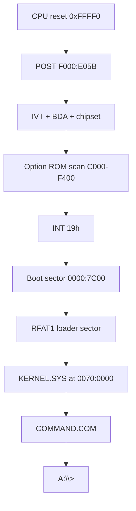

# rmDOS architecture

rmDOS is a clean-room **real-mode** stack for IBM PC/XT-class machines: system
BIOS chips (U18/U19) plus a DOS-compatible OS. Development and CI run on
[k8086](https://github.com/Trugath/k8086) (`emulator/k8086/`). The project is
MIT-licensed; see [LICENSE](../LICENSE) and [NOTICE](../NOTICE).

Cassette BASIC, protected mode, and DOS extenders are out of scope. A later
project may grow beyond real mode; **rmDOS itself stays real mode only**.

## Repository layout

```
rmdos/
|-- emulator/k8086/     # Git submodule: XT emulator + default ROMs/floppy
|-- firmware/
|   |-- bios/           # XT system BIOS → u18.bin / u19.bin
|   |-- src/boot/       # Floppy boot sector
|   |-- src/kernel/     # KERNEL.SYS (INT 20h/21h, FAT12, loader)
|   |-- src/dos/        # COMMAND.COM and userland tools
|   |-- linker/         # OS link scripts
|   |-- build/          # Generated ROMs, images, logs
|-- fixtures/guest/     # AUTOEXEC variants + SAMPLE.TXT for image packing
|-- scripts/            # as8086, mkimg, pack_roms, run-k8086, wcc
|-- tests/              # Host-side / E2E gates
|-- Makefile
```

## Boot path



1. Reset vector in U18 far-jumps to `F000:E05B`.
2. POST initializes the chipset, BDA, and IVT; scans option ROMs; then INT 19h.
3. INT 19h loads the floppy boot sector to `0000:7C00`.
4. The boot sector reads the FAT12 `RFAT1` loader and loads `KERNEL.SYS`.
5. The kernel installs INT 20h/21h, optionally runs a quiet FAT self-check, then
   starts `COMMAND.COM`. Empty `AUTOEXEC.BAT` drops to an interactive `A:\>` prompt.

## System BIOS (U18 / U19)

Clean-room XT motherboard ROMs for the 5155/5160 socket map used by k8086.
Built images are the emulator defaults under `emulator/k8086/roms/`.

| Image | Size | Linear map | Role |
|-------|------|------------|------|
| `u19.bin` | 8 KiB | `0xF6000–0xF7FFF` | Pad (`0xFF`). No Cassette BASIC. |
| `u18.bin` | 32 KiB | `0xF8000–0xFFFFF` | System BIOS |

Reset at `0xFFFF0`: `JMP FAR F000:E05B`.

Sources live under `firmware/bios/src/` (`post`, `init`, `video`, `keyboard`,
`timer`, `disk`, `misc`, entries, font).

### Compatibility surface

- IVT + BIOS Data Area (`0040:0000`)
- Equipment word (INT 11h) and conventional memory size (INT 12h)
- INT 10h (text + CGA modes 0–6), 13h, 14h, 16h, 17h, 18h, 19h, 1Ah
- IRQ0 timer (INT 08h → INT 1Ch) and IRQ1 keyboard (INT 09h)
- Option ROM scan `C000–F400` (`AA55`, checksum, far call +3)
- INT 18h prints a short “no BASIC” message (U19 is not an interpreter)

Pinned absolute entry points (k8086 and XT software expect these):

| Address | Purpose |
|---------|---------|
| `F000:E05B` | Cold/warm POST entry |
| `F000:E842` | F1 resume wait (headless auto-F1) |
| `F000:EA82` | Ctrl-Alt-Del warm-boot entry |
| `F000:F065` | INT 10h entry trampoline |
| `F000:FA6E` | 8×8 glyphs `0x00–0x7F` |

Floppy INT 13h may be satisfied by k8086’s host path; hard disk (`DL ≥ 0x80`) by
the Fixed Disk BIOS / INT 13h shim. Override ROMs with `K8086_U18_ROM` /
`K8086_U19_ROM`, `run-k8086.sh --u18/--u19`, or the workstation ROM picker.

## Operating system

DOS 3.3-ish real-mode kernel and shell, aimed at programs that run on an
8088/8086 with conventional memory only.

| Layer | Location | Role |
|-------|----------|------|
| Boot | `firmware/src/boot/` | Sector 0 + RFAT1 chain to `KERNEL.SYS` |
| Kernel | `firmware/src/kernel/` | INT 20h/21h, FAT12, MCB memory, `.COM` / MZ `.EXE` loader |
| Shell / tools | `firmware/src/dos/` | `COMMAND.COM`, DIR/TYPE/COPY/DEL, FIND/CHOICE/MORE, PING/DHCP, demos |

Notable INT 21h areas: console I/O, file create/open/read/write/seek/delete,
find-first/next, MCB alloc/free/resize, EXEC with PSP/env/FCBs, vectors
(AH=25h/35h), Ctrl-C/break, date/time, drive/cwd, mkdir/rmdir/chdir, attrs,
rename. AH=30h reports DOS 3.31.

`COMMAND.COM` supports internal CD/MD/RD/CLS, external program exec, `ECHO`,
`IF ERRORLEVEL`, and `AUTOEXEC.BAT`. `PATH=A:\BIN` is set in the kernel
environment.

Network tools (`PING`, `DHCP`) talk to the k8086 DE-220 NE2000-class card on the
virtual NAT network (typical gateway `10.0.2.2`).

### Floppy image layout

Default `os.img` / k8086 `disks/fd.img` (720 KB FAT12):

```
A:\
  KERNEL.SYS
  COMMAND.COM
  AUTOEXEC.BAT
  BIN\     DIR TYPE COPY DEL FIND CHOICE MORE PING DHCP
  DEMO\    HELLO.COM HELLO.EXE COMPAT.COM STAR.COM
  TEST\    SAMPLE.TXT
```

Packing fixtures live in [`fixtures/guest/`](../fixtures/guest/README.md)
(AUTOEXEC variants for compat / ping / dhcp / star gates).

## Build and test

```text
./setup.sh                 # submodule + k8086 installDist
make                       # u18.bin, u19.bin, os.img
make bios / make os
make install-roms          # → emulator/k8086/roms/
make install-floppy        # → emulator/k8086/disks/fd.img
make test                  # ROMs + BIOS units + OS e2e + ping
make test-dos-compat
make test-fd-img           # shipped fd.img on rmDOS ROMs
make run / make run-fd
```

BIOS service units are boot-sector images under `firmware/bios/tests/boot/`; they
print `PASS`/`FAIL` on COM1 and shut down via port `0x8900`.

## References

- IBM 5160 Technical Reference (behavioral contract for BIOS)
- [pcxtbios](https://github.com/virtualxt/pcxtbios/) — service-table reference only; source is not copied
- k8086 [`docs/architecture.md`](../emulator/k8086/docs/architecture.md) — emulator module map and boot wiring
- k8086 [`roms/README.md`](../emulator/k8086/roms/README.md) — socket layout and ROM overrides
