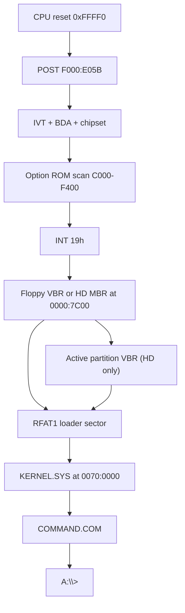

# rmDOS architecture

rmDOS is a clean-room **real-mode** stack for IBM PC/XT-class machines: system
BIOS chips (U18/U19) plus a DOS-compatible OS. Development and CI run on
[k8086](https://github.com/Trugath/k8086) (`emulator/k8086/`). The project is
MIT-licensed; see [LICENSE](../LICENSE) and [NOTICE](../NOTICE).

Cassette BASIC, protected mode, and DOS extenders are out of scope. A later
project may grow beyond real mode; **rmDOS itself stays real mode only**.

## Repository layout

```
rmdos/
|-- emulator/k8086/     # Git submodule: XT emulator + default ROMs/floppy
|-- firmware/
|   |-- bios/           # XT system BIOS → u18.bin / u19.bin
|   |-- src/boot/       # Floppy boot sector
|   |-- src/kernel/     # KERNEL.SYS (INT 20h/21h, FAT12/FAT16, loader)
|   |-- src/dos/        # COMMAND.COM and userland tools
|   |-- linker/         # OS link scripts
|   |-- build/          # Generated ROMs, images, logs
|-- fixtures/guest/     # AUTOEXEC variants + SAMPLE.TXT for image packing
|-- scripts/            # as8086, mkimg, pack_roms, run-k8086, wcc
|-- tests/              # Host-side / E2E gates
|-- Makefile
```

## Boot path



1. Reset vector in U18 far-jumps to `F000:E05B`.
2. POST initializes the chipset, BDA, and IVT; scans option ROMs; then INT 19h.
3. INT 19h tries the floppy boot sector at `0000:7C00`, then a hard-disk
   sector zero when floppy boot fails. A hard-disk MBR loads its active VBR.
4. The boot sector reads the RFAT1 loader sector and loads `KERNEL.SYS`
   (absolute LBA; independent of FAT12 vs FAT16).
5. The kernel installs INT 20h/21h, optionally runs a quiet FAT self-check, then
   starts `COMMAND.COM`. Empty `AUTOEXEC.BAT` drops to an interactive `A:\>` prompt.

## System BIOS (U18 / U19)

Clean-room XT motherboard ROMs for the 5155/5160 socket map used by k8086.
Built images are the emulator defaults under `emulator/k8086/roms/`.

| Image | Size | Linear map | Role |
|-------|------|------------|------|
| `u19.bin` | 8 KiB | `0xF6000–0xF7FFF` | Pad (`0xFF`). No Cassette BASIC. |
| `u18.bin` | 32 KiB | `0xF8000–0xFFFFF` | System BIOS |

Reset at `0xFFFF0`: `JMP FAR F000:E05B`.

Sources live under `firmware/bios/src/` (`post`, `init`, `video`, `keyboard`,
`timer`, `disk`, `misc`, entries, font).

### Compatibility surface

- IVT + BIOS Data Area (`0040:0000`)
- Equipment word (INT 11h) and conventional memory size (INT 12h)
- INT 10h (text + CGA modes 0–6), 13h, 14h, 16h, 17h, 18h, 19h, 1Ah
- IRQ0 timer (INT 08h → INT 1Ch) and IRQ1 keyboard (INT 09h)
- Option ROM scan `C000–F400` (`AA55`, checksum, far call +3)
- INT 18h prints a short “no BASIC” message (U19 is not an interpreter)

Pinned absolute entry points (k8086 and XT software expect these):

| Address | Purpose |
|---------|---------|
| `F000:E05B` | Cold/warm POST entry |
| `F000:E842` | F1 resume wait (headless auto-F1) |
| `F000:EA82` | Ctrl-Alt-Del warm-boot entry |
| `F000:F065` | INT 10h entry trampoline |
| `F000:FA6E` | 8×8 glyphs `0x00–0x7F` |

Floppy INT 13h may be satisfied by k8086’s host path; hard disk (`DL ≥ 0x80`) by
the Fixed Disk BIOS / INT 13h shim. Override ROMs with `K8086_U18_ROM` /
`K8086_U19_ROM`, `run-k8086.sh --u18/--u19`, or the workstation ROM picker.

## Operating system

DOS 3.3-ish real-mode kernel and shell, aimed at programs that run on an
8088/8086 with conventional memory only.

| Layer | Location | Role |
|-------|----------|------|
| Boot | `firmware/src/boot/` | Sector 0 + RFAT1 chain to `KERNEL.SYS` |
| Kernel | `firmware/src/kernel/` | INT 20h/21h, FAT12/FAT16 (≤40 MB), MCB memory, `.COM` / MZ `.EXE` loader |
| Shell / tools | `firmware/src/dos/` | `COMMAND.COM` and userland tools (see C vs asm below) |

### C vs assembly in userland

Most COM utilities are written in C and compiled with the in-tree **wcc**
Small-C compiler (`scripts/wcc.py` → GAS → `com.ld`). Shared INT 21h helpers
live in [`firmware/src/dos/inc/dos.h`](../firmware/src/dos/inc/dos.h).

| Built with wcc (C) | Left as assembly |
|--------------------|------------------|
| `COMMAND.COM`, DIR, TYPE, COPY, DEL, ATTRIB, LABEL, MOVE, XCOPY, CHKDSK, FIND, CHOICE, MORE, DEMO/STAR | Boot, kernel, BIOS; FORMAT, PARTEDIT, SYS; PING, DHCP, TELNET; HELLO, COMPAT |

Keep assembly where fixed layout, interrupt ABI, or dense hardware I/O dominate
(boot sector, kernel IVT/`iret`/EXEC, NE2000, INT 13h format/partition tools).
Use C for DOS API + string/logic tools.


Notable INT 21h areas: console I/O, file create/open/read/write/seek/delete,
find-first/next, MCB alloc/free/resize (including grow), EXEC with PSP/env/FCBs,
handle dup (AH=45h/46h), file datetime (AH=57h), INT 25h/26h absolute disk,
minimal INT 2Fh, vectors (AH=25h/35h), Ctrl-C/break, date/time, drive/cwd,
mkdir/rmdir/chdir, attrs, rename. AH=30h reports DOS 3.31.

`COMMAND.COM` supports internal CD/MD/RD/CLS/REN/VER/SET/PAUSE, external
program exec, `ECHO`, `IF ERRORLEVEL` / `IF EXIST`, `GOTO`/`CALL`, redirection
and pipes, and `AUTOEXEC.BAT`. `PATH=A:\BIN` is set in the kernel
environment.

Network tools (`PING`, `DHCP`, `TELNET`) talk to the k8086 DE-220 NE2000-class
card on the virtual NAT network (typical gateway `10.0.2.2`). There is no kernel
NIC driver: each COM owns the card exclusively while it runs. Shared assembly
lives under [`firmware/src/dos/inc/`](../firmware/src/dos/inc/) (`ne2000.inc`,
`netlease*.inc`, `netutil.inc`, `dns.inc`). Config is passed via cwd-relative **`LEASE.DAT`**
(24 bytes): magic `"DHCP"`, version `1`, then yiaddr / gateway / mask / DNS
(4 bytes each). `DHCP.COM` writes the file after a lease; `PING.COM` and
`TELNET.COM` refuse to run without a valid one. Both accept an IPv4 address or
DNS hostname and resolve A records via the lease DNS server (typically the NAT
gateway `10.0.2.2`, which answers from the host resolver). `TELNET host [port]`
is an outbound TCP client (default port 23) with minimal NVT (skips IAC option
negotiation) and a small ANSI CSI interpreter (`ESC[H`/`J`/`K`/cursor moves;
SGR ignored) so full-screen animations work on the CGA console. The emulator
NAT is outbound-only, so connect to a reachable non-gateway address such as
`localhost` / `127.0.0.1` (not `10.0.2.2`). Emulator card wiring:
`base=0x300,irq=3,network=default`.

The kernel reads the boot-sector BPB at init (geometry, FAT/root placement,
sectors per cluster) so volumes are not limited to a hardcoded 720 KB map.
`FORMAT [d:] [/S] [/Y]` builds FAT12 or FAT16 from INT 13h AH=08 geometry
(auto-selected by cluster count; `CountOfClusters < 4085` → FAT12) and can
install `KERNEL.SYS` + `COMMAND.COM` (`/S`). Drive letters: `A:`/`B:` are
floppies; hard-disk DOS primaries (`01h`/`04h`/`06h`) are assigned `C:` onward in
slot order per BIOS unit (`80h`, `81h`, …). A whole-disk FAT VBR (no DOS
partition) still gets one letter at LBA 0. `PARTEDIT` lists HD addresses and
primaries (with letters), edits via an interactive menu or scriptable
`/CREATE` `/DELETE` `/ACTIVE` `/TYPE` `/LIST` (primaries only; optional
`/SIZE`). `PARTEDIT /CREATE` creates an active primary (leaving track zero for
an MBR) and picks type by size (`01`/`04`/`06`); `FORMAT` rewrites that type to
match the filesystem it built. Hard disks are limited to **40 MB**; larger
geometries are rejected. The kernel uses a windowed FAT cache and remounts when
the current drive changes.

### Floppy image layout

Default `os.img` / k8086 `disks/fd.img` (720 KB FAT12):

```
A:\
  KERNEL.SYS
  COMMAND.COM
  INSTALL.BAT
  AUTOEXEC.BAT
  BIN\     DIR TYPE COPY DEL ATTRIB LABEL MOVE XCOPY CHKDSK SYS PARTEDIT
           FORMAT FIND CHOICE MORE PING DHCP TELNET
  DEMO\    HELLO.COM HELLO.EXE COMPAT.COM STAR.COM
  TEST\    SAMPLE.TXT
```

Packing fixtures live in [`fixtures/guest/`](../fixtures/guest/README.md)
(AUTOEXEC variants for compat / ping / dhcp / telnet / star / batch / disk / format /
partedit / multilet / install / fat16 gates). `INSTALL.BAT` on the floppy walks PARTEDIT → FORMAT C: /S
→ DIR C: for hard-disk installs.

## Build and test

```text
./setup.sh                 # submodule + k8086 installDist
make                       # u18.bin, u19.bin, os.img
make bios / make os
make install-roms          # → emulator/k8086/roms/
make install-floppy        # → emulator/k8086/disks/fd.img
make test                  # ROMs + BIOS units + OS e2e + ping
make test-dos-compat
make test-fd-img           # shipped fd.img on rmDOS ROMs
make run / make run-fd
```

BIOS service units are boot-sector images under `firmware/bios/tests/boot/`; they
print `PASS`/`FAIL` on COM1 and shut down via port `0x8900`.

## References

- IBM 5160 Technical Reference (behavioral contract for BIOS)
- [pcxtbios](https://github.com/virtualxt/pcxtbios/) — service-table reference only; source is not copied
- k8086 [`docs/architecture.md`](../emulator/k8086/docs/architecture.md) — emulator module map and boot wiring
- k8086 [`roms/README.md`](../emulator/k8086/roms/README.md) — socket layout and ROM overrides
